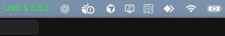

# USD Menu Bar

A lightweight macOS menu bar application that displays the current USD to BRL (Brazilian Real) exchange rate in real time.

## Features

The application runs exclusively in the macOS menu bar, providing quick access to the current dollar exchange rate without interrupting your workflow.

The menu bar displays the exchange rate in green when successfully fetched, with a loading indicator during updates and a warning icon if there is an error.

Clicking on the menu bar icon reveals options to open a detailed window, manually refresh the rate, or quit the application.

The detailed window shows the current exchange rate along with refresh and quit buttons for convenience.

Exchange rates are automatically updated every 60 seconds.

## Requirements

macOS 11.0 or later

Xcode 14.0 or later (for building from source)

## Installation

1. Clone the repository
2. Open the project in Xcode
3. Build and run the application
4. Optionally, add the built application to your Login Items for automatic startup

## Configuration

To run the app as a menu bar only application (without showing in the Dock), add the following key to the target Info settings in Xcode:

Key: Application is agent (UIElement)
Type: Boolean
Value: YES

## Architecture

The project follows a clean separation of concerns:

Models: Data structures for the exchange rate status and API response

Services: Network layer for fetching exchange rate data from the API

Controllers: UI controllers for the status bar and info window

AppDelegate: Application entry point that coordinates all components

## API

Exchange rate data is provided by the Open Exchange Rates API at open.er-api.com.

## License

This project is available under the MIT License.

